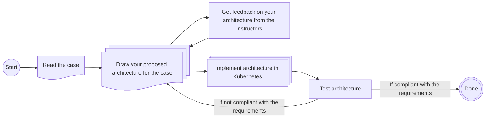

# Lecture 04 - Spark

This week's exercises will use the case-based structure described in the general overview from Lecture 01's exercise. To summarize the process:

- You will be presented with a case that needs solving.
- You must design the architecture you believe can solve this problem (use your preferred drawing tool, e.g., draw.io, Excalidraw, etc.).
  - Ideally, using the technologies covered in the course so far.
  - You will receive feedback on your proposed architecture from the instructors.
- Once the architecture has been drawn, try to assemble it using the selected technologies and blueprints.

The process can be visualized as follows:

## New Technologies

The new technologies introduced this week are: **Spark, Spark SQL and Spark Streaming**.

For some general quick start guidance on utilising the technologies, please view the archived exerises from [Lecture 04 E24](https://github.com/JakobHviidBDDST/BigDataCourseExercises/tree/main/archive/E24/04).

## Case Description

Remember PowerGrid Analytics LLC? Well they certainly remember you! And they are back for more. After your previous wonderful work, a *spark* has lit up during a C suite meeting and they have hired you again, this time to help them with distributed data streaming! 

There are a bunch of things they want you to achieve: 

Remember that unorganized employee data? Well apparently those are quite long and detailed reports, and they want the counts of specific words from the reports stored in long term storage.

Aditionally, they want to do some math with their wattage data that they meassure. First of all, they want you to calculate the averages of the sample values of the wattage data stored in long term storage. Secondly, they also want to do this live during ingestion, straight from the Kafka topic you ingest from!

NB: Remember that the theme of today's exercises is **Spark**, if you find the case's goals hard to understand, have a look at archived exercise ;)

### Solution Requirements

- The solution must be able to analyze text files from long term storage.
- The solution must be able to find the average sample values of the data stored in long term storage and the live data being ingested.

### Demonstrate

- How to analyze text files in long term storage, and getting the specific word counts.
- How to find the average sample values of data in long term storage.
- How to find the average sample values of data from a topic in a streaming platform.

### Remember to

- Identify bottlenecks.
- Consider how scalability will be handled.
- Address data flow.
- Present arguments for and discuss:
  - The usage of Spark for these tasks compared to previous technologies
