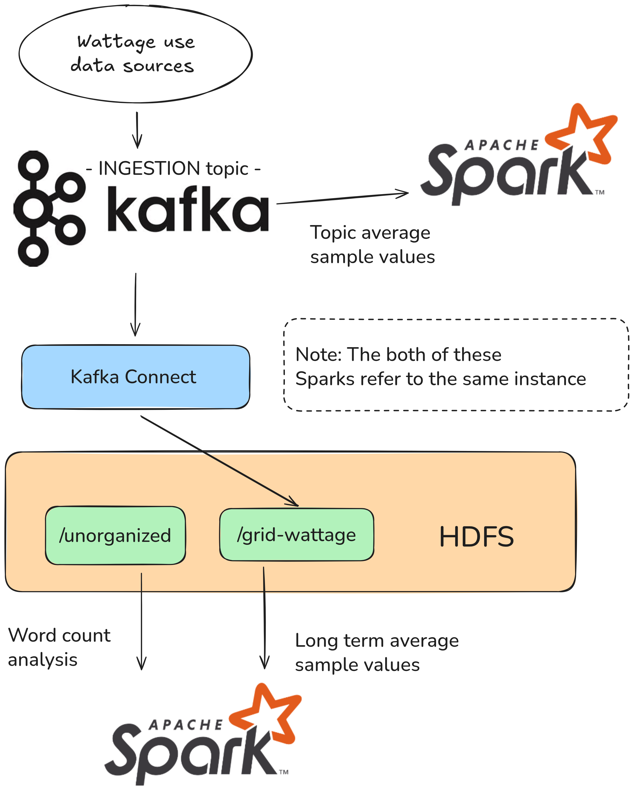

# Lecture 04 - Spark

## Case Description

Remember PowerGrid Analytics LLC? Well, they definitely remember you! And they're back for more. After your previous excellent work, a *spark* has ignited during a C-suite meeting, and they've hired you again, this time to assist with distributed data processing!

There are several objectives they want you to achieve:

Remember that unorganized employee data? Well, apparently those are quite long and detailed reports, and they want the counts of specific words from the reports stored in long-term storage.

Additionally, they want to perform some calculations with their wattage data that they measure. First, they want you to calculate the averages of the sample values of the wattage data stored in long-term storage. Second, they also want to do this live during ingestion, directly from the Kafka topic you are ingesting from!

NB: Remember that the theme of today's exercises is **Spark**, if you find the case's goals hard to understand, have a look at the archived exercise ;)

### Solution Requirements

- The solution must be able to analyze text files from long-term storage.
- The solution must be able to find the average sample values of the data stored in long-term storage and the live data being ingested.

### Demonstrate

- How to analyze text files in long-term storage, and get the specific word counts.
- How to find the average sample values of data in long-term storage.
- How to find the average sample values of data from a topic in a streaming platform.

### Remember to

- Identify bottlenecks.
- Consider how scalability will be managed.
- Address data flow.
- Present arguments for and discuss:
  - The use of **Spark** for these tasks compared to previous technologies.

# Solution Proposal

## Architecture



NB: I have greatly simplified the diagram from last lecture, to focus on the changes being made. Naturally Sqoop, Flume, etc. would still be running, but it is not needed to showcase the changes requested by PowerGrid Analytics LLC this week.

## Deployment of technologies

### Deploy and set up HDFS

Read the instructions in the [HDFS service README](../../../services/hdfs/README.md) and deploy the HDFS cluster using the provided Kubernetes manifests.

```zsh
kubectl apply -f ../../../services/hdfs/configmap.yaml
kubectl apply -f ../../../services/hdfs/namenode.yaml
kubectl apply -f ../../../services/hdfs/datanodes.yaml
```

*Verify*

```zsh
kubectl port-forward svc/namenode 9870
```

```zsh
curl -s -XGET "http://localhost:9870/webhdfs/v1/?op=LISTSTATUS"
```

Deploy the client pod to interact with HDFS. I will use the provided [interactive.yaml](../../../services/interactive/interactive.yaml) manifest in the `services/interactive` folder.

```zsh
kubectl apply -f ../../../services/interactive/interactive.yaml
```

or with this cmd

```zsh
kubectl run interactive -i --tty --image registry.gitlab.sdu.dk/jah/bigdatarepo/interactive:latest -- /bin/bash
```

*Verify*

Attach to the pod using VS Code ([README.md](../../../services/interactive/README.md#attach-visual-studio-code-to-a-running-container)) or `kubectl exec -it pod/interactive-*-* -- /bin/bash`

```zsh
curl -s -XGET "http://namenode:9870/webhdfs/v1/?op=LISTSTATUS"
```

**HDFS Folder Structure**

```text
.
├── unorganized
│   └── alice-in-wonderland.txt
│   └── ...
└── grid-wattage
    └── /INGESTION/partition=0/INGESTION+0+0000000000+0000000001.json
    └── ...
```

**Create folders using CLI**

```zsh
hdfs dfs -fs hdfs://namenode:9000 -mkdir /unorganized /grid-wattage
```

> You may need to run the following cmd:
> `export HADOOP_USER_NAME=root`.

**Verify the folders have been made:**

```zsh
hdfs dfs -fs hdfs://namenode:9000 -ls /
```

### Deploy Kafka Cluster, kafka-connect

Deploy Kafka Cluster using helm:
```zsh
helm install --values kafka-values.yaml kafka oci://registry-1.docker.io/bitnamicharts/kafka --version 30.0.4
```

Deploy kafka connect
```zsh
kubectl apply -f kafka-connect.yaml
```

NB: Kafka connect needs to be set up with the HDFS 2 Sink Connector module for the specific data sources streamed data sources. This will be done later.

We will also deploy redpanda, to have a web ui for Kafka.

```zsh
kubectl apply -f redpanda.yaml
```

And expose its to port 8080 to access it in our browser.
```zsh
kubectl port-forward svc/redpanda 8080  
```

### Deploy Spark

Deploy Spark using helm:

```zsh
helm install --values spark-values.yaml spark oci://registry-1.docker.io/bitnamicharts/spark --version 9.2.10
```

## Using the deployed the technologies

### Word counts from employee reports

Let us first tackle the issue of counting words from files in long term storage, to simulate an actual report from one of the old employees we will be using Alice in Wonderland, so let us first get that and put it inside HDFS. Run this inside the interactive container:

```zsh
curl -o alice-in-wonderland.txt https://www.gutenberg.org/files/11/11-0.txt
hdfs dfs -fs hdfs://namenode:9000 -put ./alice-in-wonderland.txt /unorganized/
```

And then check if the file is actually inside HDFS:
```zsh
hdfs dfs -fs hdfs://namenode:9000 -ls /unorganized/
```

Now we will be using `spark-submit` to submit a Spark Job to the cluster from inside the interactive container, we will be submitting the `word-count.py` Spark Job, be sure to copy all the contents of the `interactive-code` folder into the interactive container. 

Run the Spark Job by pointing to the text file:

```zsh
spark-submit word-count.py /unorganized/alice-in-wonderland.txt
```

The output should show the top 10 words, and the counts of all words in a file called `word-count.json`

### Average sample values of long term storage

To analyze data from long term storage, we must first get it into HDFS, and we might as well fill up the Kafka topic while we are at it. Therefore we will first get the `simple-poducer.py` running from inside the interactive container, whereafter we will set up a kafka connect sink:

```zsh
kubectl port-forward svc/kafka-connect 8083
```

```zsh
curl -X POST \
http://127.0.0.1:8083/connectors \
-H 'Content-Type: application/json' \
-d '{
    "name": "hdfs-sink",
    "config": {
        "connector.class": "io.confluent.connect.hdfs.HdfsSinkConnector",
        "tasks.max": "3",
        "topics": "INGESTION",
        "hdfs.url": "hdfs://namenode:9000",
        "topics.dir": "/grid-wattage/",
        "flush.size": "3",
        "format.class": "io.confluent.connect.hdfs.json.JsonFormat",
        "key.converter.schemas.enable":"false",
        "key.converter": "org.apache.kafka.connect.storage.StringConverter",
        "key.converter.schema.registry.url": "http://kafka-schema-registry:8081", 
        "value.converter.schemas.enable":"false",
        "value.converter.schema.registry.url": "http://kafka-schema-registry:8081", 
        "value.converter": "org.apache.kafka.connect.json.JsonConverter"
    }
}'
```

We can then check if the sink from Kafka to HDFS is working:
```zsh
hdfs dfs -fs hdfs://namenode:9000 -ls /grid-wattage
```

Finally we can check the average wattage use by submitting the `avg-modalities.py` Spark Job, the results should be shown in the cmd by Sensor Id.


### Average sample values of INGESTION topic in Kafka

We already started producer in the last bit, so the INGESTION topic should be getting filled with new sensor data.


For this we will be making use of some of the features of a package called `spark-sql-kafka` Spark Structured Streaming to read directly from Kafka topics, meaning we need to send the package along with the Spark Job for it to work. We will be using the `process-streaming.py` file for this final job.
```zsh
spark-submit --packages org.apache.spark:spark-sql-kafka-0-10_2.12:3.5.2 process-streaming.py
```

This will run for a while, but should display the average wattage, per sensor, in the cmd.