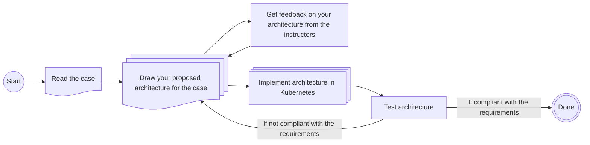

# Lecture 05 - Distributed Data Processing and Distributed Databases

This week's exercises will follow the case-based structure explained in the overview from Lecture 01's exercise. To summarize the process:

- You will receive a case that needs solving.
- You should design the architecture that you believe can solve this problem (use your preferred drawing tool, such as draw.io, Excalidraw, etc.).
  - Ideally, use the technologies covered in the course so far.
  - You will get feedback on your proposed architecture from the instructors.
- Once you've drawn the architecture, try to assemble it using the chosen technologies and blueprints.

The process can be visualized as follows:

## New Technologies

The new technologies introduced this week are: **Hive, MongoDB, Redis**.

For some general quick start guidance on utilising the technologies, please view the archived exercises from [Lecture 05 E24](https://github.com/JakobHviidBDDST/BigDataCourseExercises/tree/main/archive/E24/05).

## Case Description

PowerGrid Analytics LLC is eager for your expertise! Following your excellent work with distributed processing using Spark, another C-suite meeting has focused on you. This time, they aim to go beyond just Spark and build a complete distributed data ecosystem, including distributed databases.

The company has realized that managing power grid data requires not only quick computation but also structured storage, flexible document management, and real-time responsiveness. Your task is to help them expand their operational data architecture using **Hive**, **MongoDB**, and **Redis**.

### Solution Requirements

- The solution must be capable of analyzing text files stored long-term with SQL and Hive.
- The solution must be able to store documents from a Kafka topic.
- The solution must be able to cache the most recent records from each station for low-latency retrieval.

### Demonstrate

- How to analyze text files in long-term storage and obtain specific word counts.
- How to store documents from a Kafka topic.
- How to cache records for low-latency retrieval.

### Remember to

- Identify bottlenecks.
- Consider how scalability will be managed.
- Address data flow.
- Present arguments for and discuss:
  - The use of **Hive** for these tasks compared to previous technologies.
  - The use of **MongoDB** for these tasks compared to previous technologies.
  - The use of **Redis** for these tasks compared to previous technologies.
