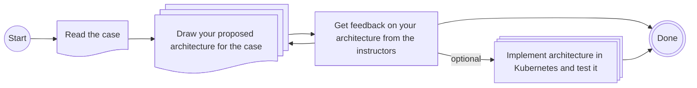

# Lecture 05 - Distributed Data Processing and Distributed Databases

The new technologies introduced this week are: **Hive, MongoDB, Redis**.

This week's exercise consists of two parts. First, practical exercises where you have to deploy the technologies you learned about today. Secondly, design a system based on a cased-based structure.

## The Practical Exercise
The practical exercises are located in [lectures/05/exercise/README.md](./exercise/README.md)

## The Theoretical Exercise
- You will be presented with a case that needs solving.
- You must design the architecture you believe can solve this problem (use your preferred drawing tool, e.g., draw.io, Excalidraw, etc.).
  - Ideally, using the technologies covered in the course so far.
  - You will receive feedback on your proposed architecture from the instructors.
- Once the architecture has been drawn, try to assemble it using the selected technologies and blueprints.

The process can be visualized as follows:

```mermaid
flowchart LR
    start@{ shape: circle, label: "Start" }
    case@{ shape: doc, label: "Read the case" }
    arch@{ shape: docs, label: "Draw your proposed architecture for the case" }
    feedback@{ shape: note, label: "Get feedback on your architecture from the instructors" }
    impl@{ shape: processes, label: "Implement architecture in Kubernetes and test it" }
    stop@{ shape: dbl-circ, label: "Done" }

    start-->case-->arch-->feedback-->stop

    feedback-->arch
    feedback-->|"optional"|impl-->stop
```

### Case Description

PowerGrid Analytics LLC is eager for your expertise! Following your excellent work with distributed processing using Spark, another C-suite meeting has focused on you. This time, they aim to go beyond just Spark and build a complete distributed data ecosystem, including distributed databases.

The company has realized that managing power grid data requires not only quick computation but also structured storage, flexible document management, and real-time responsiveness. Your task is to help them expand their operational data architecture using **Hive**, **MongoDB**, and **Redis**.

#### Solution Requirements

- The solution must be capable of analyzing text files stored long-term storage with SQL using Hive.
- The solution must be able to store documents in MongoDB from a Kafka topic.
- The solution must be able to cache the most recent records from each station for low-latency retrieval.

#### Demonstrate

- How to analyze text files in long-term storage and obtain specific word counts.
- How to store documents from a Kafka topic.
- How to cache records for low-latency retrieval.

#### Remember to

- Identify bottlenecks.
- Consider how scalability will be managed.
- Address data flow.
- Present arguments for and discuss:
  - The use of **Hive** for these tasks compared to previous technologies.
  - The use of **MongoDB** for these tasks compared to previous technologies.
  - The use of **Redis** for these tasks compared to previous technologies.
