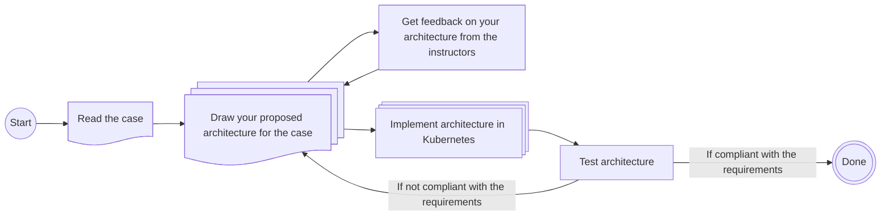

# Lecture 07 - Metadata, Data Provenance and Data Mesh

This week's exercises will follow the case-based structure explained in the overview from Lecture 01's exercise. To summarize the process:

- You will receive a case that needs solving.
- You should design the architecture that you believe can solve this problem (use your preferred drawing tool, such as draw.io, Excalidraw, etc.).
  - Ideally, use the technologies covered in the course so far.
  - You will get feedback on your proposed architecture from the instructors.
- Once you've drawn the architecture, try to assemble it using the chosen technologies and blueprints.

The process can be visualized as follows:

## New Technologies

The new technologies introduced this week are: **DataHub**.

For some general quick start guidance on utilising the technologies, please view the archived exercises from [Lecture 07 E24](https://github.com/JakobHviidBDDST/BigDataCourseExercises/tree/main/archive/E24/07).

## Case Description

PowerGrid Analytics LLC has listened to your valuable insights and feedback from previous tasks and has decided to further improve their data ecosystem.

They identified a critical missing element in their data ecosystem: metadata management. To enhance metadata for data flows, evolution, and movement across systems, the company needs strict management of schemas, lineage, versioning, governance, catalogs, and consistency. Without this, the ecosystem risks becoming an inconsistent “data swamp,” with duplicated semantics, confusion about the source of truth, hidden dependencies, and fragile interfaces.

Your task is to help them incorporate technology into their data governance architecture using **DataHub**, created by LinkedIn.

### Solution Requirements

As the data architect and engineer, you will design and build a prototype of this ecosystem. You will:

- Deploy and configure **DataHub** in Kubernetes.
- Create at least one data flow with a data source and a data sink (e.g., Kafka, Hive, MongoDB, Redis).
- Configure the metadata catalog service to track schemas, lineage, versioning, quality metrics, access policies, and explore the API for serivce discovery.
- Demonstrate consistency/provenance (e.g., between Hive and MongoDB results), cache misses, schema evolution, and metadata usage.

### Demonstrate

- How to organize metadata.
- How to add ingestion sources like Kafka, Hive, MongoDB, or Redis.

### Remember to

- Identify bottlenecks.
- Consider how scalability will be managed.
- Address data flows.
