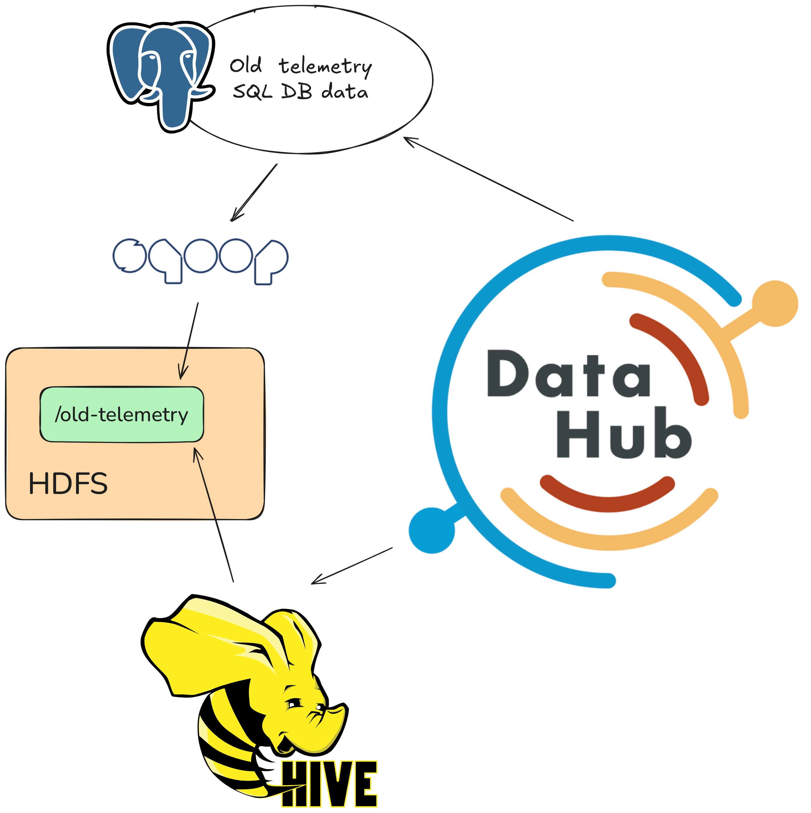

# Lecture 07 - Metadata, Data Provenance and Data Mesh

## Case Description

PowerGrid Analytics LLC has listened to your valuable insights and feedback from previous tasks and has decided to further improve their data ecosystem.

They identified a critical missing element in their data ecosystem: metadata management. To enhance metadata for data flows, evolution, and movement across systems, the company needs strict management of schemas, lineage, versioning, governance, catalogs, and consistency. Without this, the ecosystem risks becoming an inconsistent “data swamp,” with duplicated semantics, confusion about the source of truth, hidden dependencies, and fragile interfaces.

Your task is to help them incorporate technology into their data governance architecture using **DataHub**, created by LinkedIn.

### Solution Requirements

As the data architect and engineer, you will design and build a prototype of this ecosystem. You will:

- Deploy and configure **DataHub** in Kubernetes.
- Create at least one data flow with a data source and a data sink (e.g., Kafka, Hive, MongoDB, Redis).
- Configure the metadata catalog service to track schemas, lineage, versioning, quality metrics, access policies, and explore the API for serivce discovery.
- Demonstrate consistency/provenance (e.g., between Hive and MongoDB results), cache misses, schema evolution, and metadata usage.

### Demonstrate

- How to organize metadata.
- How to add ingestion sources like Kafka, Hive, MongoDB, or Redis.

### Remember to

- Identify bottlenecks.
- Consider how scalability will be managed.
- Address data flows.


# Solution Proposal

## Architecture



This is largely based on the architecutre from lecture 03, where I have put the focus on using Datahub for Postgres and for Hive.

Ideally I would use Kafka, but the Kafka ingestion is broken due to a change in Confluent Kafka's dependencies needing httpx, this can most likely be fixed by using newer Datahub versions or custom images, in case you want to use Kafka with Datahub for your project.

## Deployment of technologies

### Deploy and set up HDFS

Read the instructions in the [HDFS service README](../../../services/hdfs/README.md) and deploy the HDFS cluster using the provided Kubernetes manifests.

```zsh
kubectl apply -f ../../../services/hdfs/configmap.yaml
kubectl apply -f ../../../services/hdfs/namenode.yaml
kubectl apply -f ../../../services/hdfs/datanodes.yaml
```

*Verify*

```zsh
kubectl port-forward svc/namenode 9870
```

```zsh
curl -s -XGET "http://localhost:9870/webhdfs/v1/?op=LISTSTATUS"
```

Deploy the client pod to interact with HDFS. I will use the provided [interactive.yaml](../../../services/interactive/interactive.yaml) manifest in the `services/interactive` folder.

```zsh
kubectl apply -f ../../../services/interactive/interactive.yaml
```

or with this cmd

```zsh
kubectl run interactive -i --tty --image registry.gitlab.sdu.dk/jah/bigdatarepo/interactive:latest -- /bin/bash
```

*Verify*

Attach to the pod using VS Code ([README.md](../../../services/interactive/README.md#attach-visual-studio-code-to-a-running-container)) or `kubectl exec -it pod/interactive-*-* -- /bin/bash`

```zsh
curl -s -XGET "http://namenode:9870/webhdfs/v1/?op=LISTSTATUS"
```

**HDFS Folder Structure**

```text
.
└── old-telemetry
    └── part-m-00000
    └── part-m-00001
    └── ....
```

**Create folders using CLI**

```zsh
hdfs dfs -fs hdfs://namenode:9000 -mkdir /old-telemetry
```

> You may need to run the following cmd:
> `export HADOOP_USER_NAME=root`.

**Verify the folders have been made:**

```zsh
hdfs dfs -fs hdfs://namenode:9000 -ls /
```

### Deploy sqoop

```zsh
kubectl apply -f sqoop.yaml
```

### Deploy Hive
To deploy Hive, it needs a Postgres instance:
```zsh
helm install postgresql-hive \
  --version=12.1.5 \
  --set auth.username=root \
  --set auth.password=pwd1234 \
  --set auth.database=hive \
  --set primary.extendedConfiguration="password_encryption=md5" \
  --repo https://charts.bitnami.com/bitnami \
  postgresql
```

Whereafter we need to deploy the Hive Metastore and Hive Server:
```zsh
kubectl apply -f hive-metastore.yaml
kubectl apply -f hive.yaml
```

### Deploy datahub

To deploy datahub we need to define some secrets first, one for mysql and one for neo4j:
```zsh
kubectl create secret generic mysql-secrets --from-literal=mysql-root-password=datahubdatahub --from-literal=mysql-username=root
```
```zsh
kubectl create secret generic neo4j-secrets --from-literal=neo4j-password=datahubdatahub --from-literal=neo4j-username=neo4j --from-literal=NEO4J_AUTH=neo4j/datahubdatahub
```

Now we need to deploy Datahub itself in two increments, first we must deploy some prerequisites, these being Elasticsearch, Kafka, Neo4j and MySQL, as Datahub needs these to run.

```zsh
helm install prerequisites datahub/datahub-prerequisites --values prerequisites-values.yaml --version 0.1.13
```

Then we can deploy Datahub itself (note: this will take serveral (6+) minutes)

```zsh
helm install datahub datahub/datahub --values values.yaml --version 0.4.27
```

Once this is done, you should be able to port-forward the frontend: 
```zsh
kubectl port-forward svc/datahub-datahub-frontend 9002
```
And login with:
- username: `datahub`
- password: `datahub`

## Using the deployed the technologies

### Ingestion of structured data with sqoop

We are going to repeat the process from lecture 3, to emulate having structured data:

```zsh
helm install postgresql-telemetry \
  --version=12.1.5 \
  --set auth.username=root \
  --set auth.password=pwd1234 \
  --set auth.database=telemetry \
  --set primary.extendedConfiguration="password_encryption=md5" \
  --repo https://charts.bitnami.com/bitnami \
  postgresql
```

Then we will go into an interactive shell with the Postgres deployment, add a telemetry table, and seed it with data.

```zsh
kubectl exec -it postgresql-telemetry-0  -- bash
```

```zsh
PGPASSWORD=pwd1234 psql -U root -d telemetry
```

```zsh
CREATE TABLE telemetry (
  id SERIAL PRIMARY KEY,
  name VARCHAR(255) NOT NULL,
  wattage INT NOT NULL
);

INSERT INTO telemetry (name, wattage) VALUES
('Node1', 75000),
('Node2', 65000),
('Node3', 60000),
('Node4', 80000);
```

We should also verify that the telemtry has been added
```zsh
SELECT * FROM telemetry;
```

Now we need to ingest it with Sqoop into HDFS, to do that we need to get interactive with sqoop:
```zsh
kubectl exec -it sqoop-<ID> -- bash
```

And then we can use ingest the database into sqoop like so:
```zsh
sqoop import \
--connect "jdbc:postgresql://postgresql-telemetry:5432/telemetry" \
--username root \
--password pwd1234 \
--table telemetry \
--target-dir /old-telemetry \
--direct \
--m 1
```

Then we can verify the contents of the `/old-telemetry` folder in HDFS with
```zsh
hdfs dfs -fs hdfs://namenode:9000 -cat /old-telemetry/*
```

### Create Hive table on HDFS data

Now we need to create a Hive database and table that points to the data in HDFS. 

First we port-forward the Hive service:
```zsh
kubectl port-forward svc/hiveserver2 10000:10000
```

Then we can use **DBeaver** to create a connection to Hive with these credisentials:
- **Host**: `localhost`
- **Port**: `10000`
- **Database/Schema**: `default`
- **Authentication**: None
- **Username**: `root`

Once connected, run the following SQL queries in DBeaver:

Create a database for telemetry data:
```sql
CREATE DATABASE IF NOT EXISTS telemetry_db 
LOCATION 'hdfs://namenode:9000/user/hive/warehouse/telemetry_db.db/';
```

Create a table pointing to the Sqoop-imported data in HDFS:
```sql
CREATE TABLE telemetry_db.telemetry (
  id INT,
  name STRING,
  wattage INT
)
STORED AS TEXTFILE
LOCATION 'hdfs://namenode:9000/old-telemetry';
```

Verify the table was created and data is accessible:
```sql
SELECT * FROM telemetry_db.telemetry;
```

### Collecting the metadata with Datahub